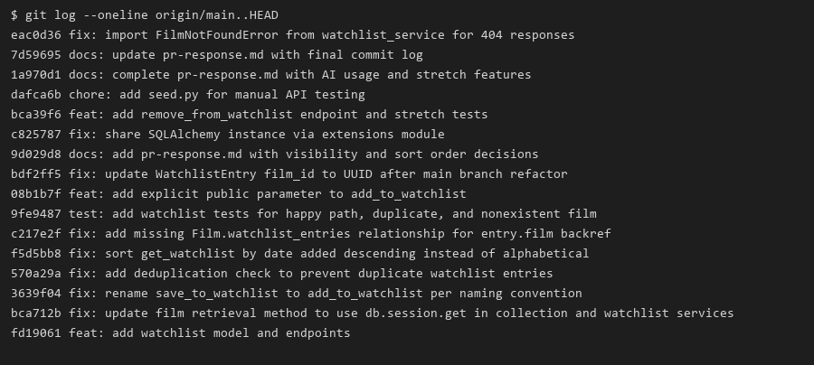

# PR Response Doc — CineLog Watchlist Feature

## AI Usage

I used AI tools in three specific ways during this project:

1. **Codebase orientation:** I pasted `models.py`, `services/collection_service.py`, and `tests/test_collection.py` and asked for a summary of naming conventions, deduplication patterns, and test structure before touching the watchlist code. This helped me mirror `add_to_collection()` for Comments 2 and 3 instead of inventing a new pattern.

2. **Stress-testing design arguments (Comments 4 and 5):** I asked: *"What counterargument would a careful code reviewer raise against keeping `public=True` as the default for watchlist entries?"* The AI pointed out that watchlists reveal forward-looking intent, which is more sensitive than a collection of past watches. I incorporated that into Comment 4's tradeoff section and added an explicit `public` parameter so callers can opt out per entry.

3. **Debugging the runtime error:** When `GET /films/` returned a 500 (`Flask app is not registered with this SQLAlchemy instance`), I used AI to diagnose the dual-import problem (`python app.py` vs `from app import db`). The fix was moving `db` to a shared `extensions.py` module.

I did **not** ask AI to write the deduplication logic or the design decisions wholesale — those were written after reading the collection service and the reviewer's comments directly.

## Comment 1 — Rename
**What I did:** Renamed `save_to_watchlist()` to `add_to_watchlist()` in `services/watchlist_service.py`, matching the `verb_to_noun` convention used by `add_to_collection()` / `remove_from_collection()` / `get_collection()`. Updated the docstring and the call site in `routes/watchlist/watchlist.py` (import and function call).

**How I verified:** Searched the repo for `save_to_watchlist` before and after — zero hits remain. Ran `python -m pytest tests/ -v` to confirm nothing broke.

## Comment 2 — Deduplication
**What I did:** Added an `AlreadyOnWatchlistError` exception and a duplicate check in `add_to_watchlist()`, mirroring `add_to_collection()`'s pattern: query `WatchlistEntry.query.filter_by(user_id=user_id, film_id=film_id).first()` before inserting, and raise if an entry already exists. Updated `routes/watchlist/watchlist.py` to catch `FilmNotFoundError` (404) and `AlreadyOnWatchlistError` (409), matching how `routes/collection.py` handles the same exceptions.

**How I verified:** `test_add_to_watchlist_duplicate_raises` confirms a second add raises instead of creating a duplicate row. All tests pass.

## Comment 3 — Missing test
**What I did:** Created `tests/test_watchlist.py`, mirroring the fixture setup and structure from `tests/test_collection.py`. Added:
- `test_add_to_watchlist_nonexistent_film_raises` — asserts `FilmNotFoundError` for a missing `film_id`
- `test_add_to_watchlist_creates_entry` — happy path
- `test_add_to_watchlist_duplicate_raises` — locks in Comment 2's dedup behavior
- `test_get_watchlist_returns_newest_first` — sort order (Comment 5)

**How I verified:** `python -m pytest tests/ -v` — all watchlist tests pass.

## Comment 4 — Default visibility
**My position:** Keep `public=True` as the default for new watchlist entries, but make it an explicit, overridable parameter (`add_to_watchlist(user_id, film_id, public=True)`) instead of only a buried model default.

**Reasoning:** `get_watchlist()` currently returns every entry unfiltered — no code path restricts reads by `public`. So the default has no enforcement effect today. The decision is which value we want sitting in the database when a visibility-aware feature ships later. Defaults are sticky: if we shipped `public=False` now and added discovery later, early entries would be invisible without a backfill. `public=True` costs nothing today and doesn't foreclose a future discovery feature. It is also consistent with `CollectionEntry`, which has no visibility field and is fully exposed via `GET /collection/<user_id>`.

**Tradeoff acknowledged:** A watchlist can expose forward-looking intent (more sensitive than a collection of past watches). I address this by making `public` an explicit parameter so callers can opt out per entry. `test_add_to_watchlist_respects_public_false` verifies `public=False` persists correctly. Before this ships to end users as privacy-respecting, `public` needs to be enforced on read paths — that enforcement is outside the scope of these six comments.

## Comment 5 — Sort order
**My position:** Agreed — implemented date-added descending (newest first) for `get_watchlist()`, replacing alphabetical (`Film.title.asc()`).

**Reasoning:** This aligns with `get_collection()`, which already sorts by `date_added.desc()`. Both functions return a user's personal list of (film, timestamp) associations; having one chronological and one alphabetical would be inconsistent. The reviewer's point that users want to see recent additions is the same bet CineLog already made for collections.

**Engagement with reviewer's point:** Alphabetical order does help re-find a specific title in a long watchlist — a legitimate counterargument. I did not add a `?sort=` parameter because neither list supports search/filter today, and building it only for watchlist would be new scope. If this becomes painful, the fix is a search endpoint, not keeping alphabetical as the default. While implementing this, I also fixed a missing `Film.watchlist_entries` relationship that caused `entry.film` to raise `AttributeError` for any non-empty watchlist.

**How I verified:** `test_get_watchlist_returns_newest_first` mirrors `test_get_collection_returns_newest_first`.

## Comment 6 — Rebase
**What conflicted:** Ran `git fetch origin && git rebase origin/main`. `main` had moved forward with `refactor: migrate film IDs from integer to UUID`. No explicit conflict markers appeared, but the rebase silently dropped the `WatchlistEntry` class from `models.py` — git's 3-way merge saw "unchanged on my side, deleted on main's side" and took the deletion.

**How I resolved it:** Caught the issue when `pytest` failed with `ImportError: cannot import name 'WatchlistEntry'`. Restored `WatchlistEntry` in `models.py` with `film_id` as `db.String(36)` (UUID), added a `unique_user_film_watchlist` constraint, and updated stale integer references in docstrings, route comments, and the test fixture (`"00000000-0000-0000-0000-000000000000"`).

**How I verified no conflict remains:** `python -m pytest tests/ -v` — all tests pass. `git log --oneline --merges origin/main..HEAD` returns empty (linear history, no merge commits).

## Stretch Features

**`remove_from_watchlist()`:** Added `remove_from_watchlist(user_id, film_id)` in `services/watchlist_service.py`, a `DELETE /watchlist/<user_id>/remove` route, and tests (`test_remove_from_watchlist_removes_entry`, `test_remove_from_watchlist_not_on_list_raises`). Mirrors `remove_from_collection()` / `NotInCollectionError` pattern.

**Second edge-case test:** `test_add_to_watchlist_respects_public_false` — verifies callers can override the `public=True` default by passing `public=False`, ensuring the visibility toggle is not just a model default but an actual API parameter.

**`seed.py`:** Added a helper script so manual testing doesn't require writing inline Python to create UUIDs.

## Commit History

`git log --oneline origin/main..HEAD` — conventional commits, no merge commits:



```
eac0d36 fix: import FilmNotFoundError from watchlist_service for 404 responses
7d59695 docs: update pr-response.md with final commit log
1a970d1 docs: complete pr-response.md with AI usage and stretch features
dafca6b chore: add seed.py for manual API testing
bca39f6 feat: add remove_from_watchlist endpoint and stretch tests
c825787 fix: share SQLAlchemy instance via extensions module
9d029d8 docs: add pr-response.md with visibility and sort order decisions
bdf2ff5 fix: update WatchlistEntry film_id to UUID after main branch refactor
08b1b7f feat: add explicit public parameter to add_to_watchlist
9fe9487 test: add watchlist tests for happy path, duplicate, and nonexistent film
c217e2f fix: add missing Film.watchlist_entries relationship for entry.film backref
f5d5bb8 fix: sort get_watchlist by date added descending instead of alphabetical
570a29a fix: add deduplication check to prevent duplicate watchlist entries
3639f04 fix: rename save_to_watchlist to add_to_watchlist per naming convention
bca712b fix: update film retrieval method to use db.session.get in collection and watchlist services
fd19061 feat: add watchlist model and endpoints
```

> **Git log screenshot:** Embedded above. 16 conventional commits, zero merge commits.

## PR Description

**What this feature does:** Adds a watchlist to CineLog — films a user wants to watch later, separate from their collection of watched films. Users can add a film (`POST /watchlist/<user_id>/add`), view their watchlist sorted by most-recently-added (`GET /watchlist/<user_id>`), and remove a film (`DELETE /watchlist/<user_id>/remove`). Duplicate adds return 409; missing films return 404; removing a film not on the list returns 404.

**Design decisions:**
- **Default visibility:** New entries default to `public=True`, with an explicit `public` parameter on `add_to_watchlist()` and an optional `"public"` field in the POST body. Full reasoning: Comment 4 above.
- **Sort order:** `get_watchlist()` returns entries by `date_added` descending (newest first), matching `get_collection()`. Full reasoning: Comment 5 above.

**How to manually test end to end:**
```bash
pip install -r requirements.txt
python app.py          # keep this terminal open

# In a second terminal:
python seed.py         # prints user_id and film_ids

# Then test (replace UUIDs from seed.py output):
# GET  http://127.0.0.1:5000/
# GET  http://127.0.0.1:5000/films/
# GET  http://127.0.0.1:5000/watchlist/<user_id>
# POST http://127.0.0.1:5000/watchlist/<user_id>/add  body: {"film_id": "<film_id>"}
# POST again → expect 409
# DELETE http://127.0.0.1:5000/watchlist/<user_id>/remove  body: {"film_id": "<film_id>"}
# GET watchlist again → expect []
```

Or run: `python -m pytest tests/ -v` (11 tests, all passing).
